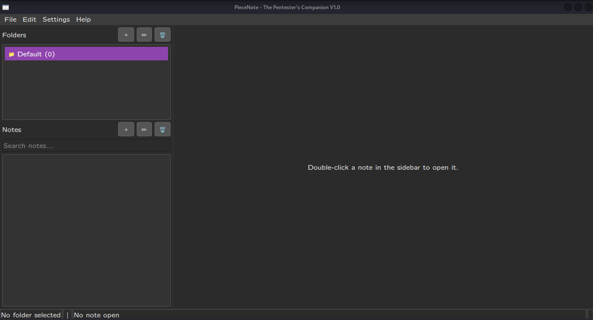

# PieceNote - A Modular Note-Taking App for Technical Reports



PieceNote is a lightweight, database-backed desktop application built with Python and Qt, designed to streamline note-taking and report generation for security professionals, developers, and system administrators. It solves the "single messy file" problem by providing a structured, fast, and feature-rich environment for building technical documents piece by piece.

---

## Key Features

-   **Robust Database Storage:**
    -   All data is stored in a transactional **SQLite database**, preventing data corruption and ensuring fast, reliable access.
    -   **Automatic Backups:** Creates a backup of the database before every save operation to protect against data loss.
    -   **Corruption Detection:** On startup, the app can detect a corrupt database and offer to restore from the last known good backup.

-   **Multi-Tab Live Markdown Editor:**
    -   A fluid writing experience with a split-view, live-updating preview pane.
    -   **Interactive Checklists:** Create checklists with `- [ ]` and click them in the preview to toggle their state.
    -   **Full Markdown Support:** Renders tables, syntax-highlighted code blocks, images, and more.

-   **Workflow-Centric Tools:**
    -   **Threaded Command Runner:** Execute shell commands directly from the app and embed their timestamped output into your notes. The UI never freezes, even on long-running commands like `nmap`.
    -   **Quick Image Embedding:** Instantly add screenshots and other images to your notes as evidence.

-   **Effortless Organization & Navigation:**
    -   Organize your work into **Folders** (for projects) and re-orderable **Notes** (for sections).
    -   **Full-Text Search:** Instantly search the content of all notes across all folders (`Ctrl+F`).
    -   **Live Title Filter:** Quickly filter the notes list in the current folder as you type.

-   **Professional Experience & Export:**
    -   **Customizable Settings:** Fine-tune the editor font, autosave frequency, and key file paths.
    -   **Session Persistence:** The application remembers your window size, position, and layout between sessions.
    -   **Detailed Status Bar:** Get live metrics on your current note, including word count, characters, lines, images, and links.
    -   **Multi-Format Export:** Export single notes, multiple notes, or entire folders into a clean, professionally-styled **HTML** or **PDF** document.

---

## Technology Stack

-   **Core:** Python 3
-   **GUI:** PySide6 (The official Qt 6 for Python bindings)
-   **Database:** SQLite 3
-   **Markdown Rendering:** `markdown` with `Pygments` (for syntax highlighting) and `pymdown-extensions` (for checklists)
-   **PDF Export:** `xhtml2pdf`

---

## Installation & Usage

#### Prerequisites
- Python 3.8+

#### Setup
1.  **Clone the repository:**
    ```bash
    git clone [Your-Repo-SSH-or-HTTPS-Link]
    cd PieceNote
    ```
2.  **Set up a virtual environment (recommended):**
    ```bash
    python -m venv venv
    source ven.../bin/activate  # On Windows: venv\Scripts\activate
    ```
3.  **Install all dependencies:**
    ```bash
    pip install -r requirements.txt
    ```
4.  **Run the application:**
    ```bash
    python main.py
    ```
---

## Architectural Highlights

-   **Decoupled Storage Manager:** The `StorageManager` class acts as a dedicated interface for all data operations. The rest of the application is completely decoupled from the SQLite backend, making the system modular and easy to maintain.
-   **Multi-Threading for UI Responsiveness:** Long-running operations like shell commands are offloaded from the main GUI thread using `QThread` and worker objects, ensuring the user interface remains fluid at all times.
-   **Asynchronous UI Updates:** The Markdown preview uses a debounced `QTimer` to render only after the user has paused typing, preventing lag and making the editor feel instantaneous, even with large documents.

---

## License

This project is licensed under the MIT License. See the `LICENSE` file for details.
