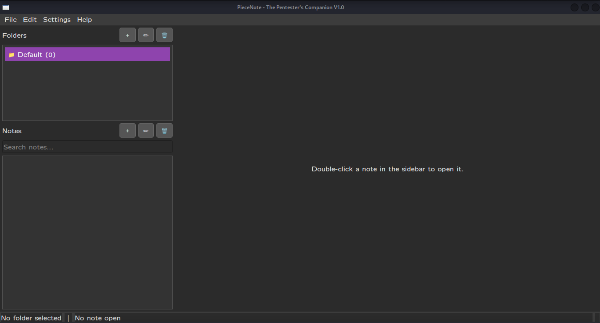

# PieceNote - A Modular Note-Taking App for Technical Reports



PieceNote is a lightweight, database-backed desktop application built with Python and Qt, designed to streamline note-taking and report generation for security professionals, developers, and system administrators. It solves the "single messy file" problem by providing a structured, fast, and feature-rich environment for building technical documents piece by piece.

---

## Key Features

-   **Robust Database Storage:**
    -   All data is stored in a transactional **SQLite database**, preventing data corruption and ensuring fast, reliable access.
    -   **Automatic Backups:** Creates a backup of the database before every save operation to protect against data loss.
    -   **SOC 2 Aligned Encryption:** Supports master password based database encryption using PBKDF2 and Fernet.

-   **Multi-Tab Live Markdown Editor:**
    -   A fluid writing experience with a split-view, live-updating preview pane.
    -   **Interactive Checklists:** Create checklists with `- [ ]` and click them in the preview to toggle their state.
    -   **Full Markdown Support:** Renders tables, syntax-highlighted code blocks, images, and more.

-   **SOC 2 Grade Security:**
    -   **Structured Audit Logging:** Tracks all sensitive operations in a structured JSON format.
    -   **Inactivity Auto-Lock:** Automatically locks the application after 15 minutes of inactivity.
    -   **Hardened Command Runner:** Strict whitelist and regex-based argument validation for shell commands.
    -   **Secure Sanitization:** Uses `bleach` for HTML sanitization in the markdown preview.

-   **Performance Optimized:**
    -   **Background Persistence:** Database saves are debounced and performed in the background.
    -   **Efficient UI:** Uses `setUpdatesEnabled` and optimized list population for large data sets.
    -   **Intelligent Caching:** Markdown rendering is cached to minimize CPU usage.

-   **Effortless Organization & Navigation:**
    -   Organize your work into **Folders** (for projects) and re-orderable **Notes** (for sections).
    -   **Full-Text Search:** Instantly search the content of all notes across all folders (`Ctrl+F`).

-   **Professional Experience & Export:**
    -   **Modern Dark Theme:** A Fluent-inspired professional dark theme for reduced eye strain.
    -   **Detailed Status Bar:** Live metrics including word count, character count, and document structure.
    -   **Multi-Format Export:** Export to **HTML**, **PDF**, or **Markdown**.

---

## Technology Stack

-   **Core:** Python 3
-   **GUI:** PySide6
-   **Database:** SQLite 3
-   **Markdown Rendering:** `markdown` with `Pygments` and `pymdown-extensions`
-   **PDF Export:** `xhtml2pdf`
-   **Security:** `cryptography`, `bleach`

---

## Installation & Usage

#### Prerequisites
- Python 3.8+

#### Setup
1.  **Clone the repository:**
    ```bash
    git clone [Your-Repo-SSH-or-HTTPS-Link]
    cd PieceNote
    ```
2.  **Install all dependencies:**
    ```bash
    pip install -r requirements.txt
    ```
3.  **Run the application:**
    ```bash
    python main.py
    ```
---

## Architectural Highlights

-   **Decoupled Storage Manager:** The `StorageManager` class acts as a dedicated interface for all data operations, abstracting the SQLite and encryption logic.
-   **Multi-Threading for UI Responsiveness:** Long-running operations like shell commands are offloaded from the main GUI thread using `QThread`.
-   **Audit Trail:** Every security-sensitive action is recorded in `app.log` with detailed JSON metadata.

---

## License

This project is licensed under the MIT License. See the `LICENSE` file for details.
